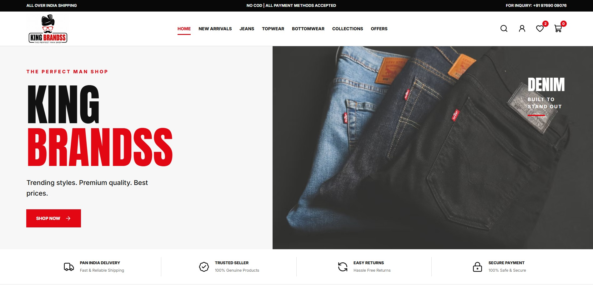
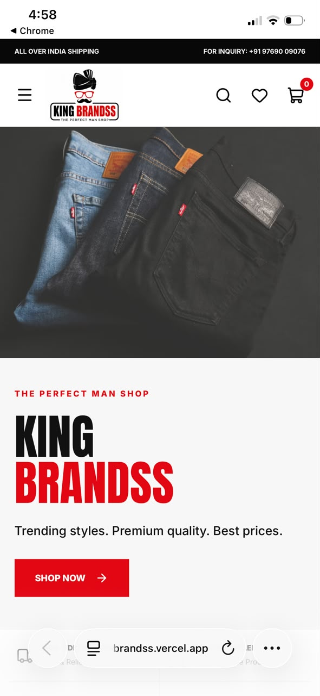
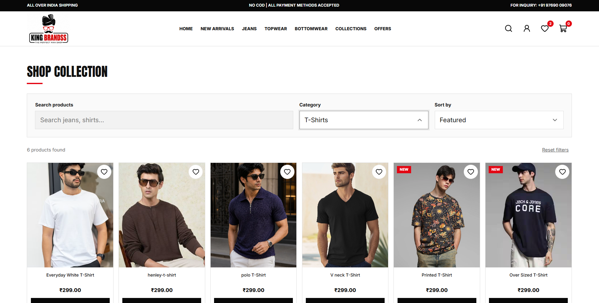
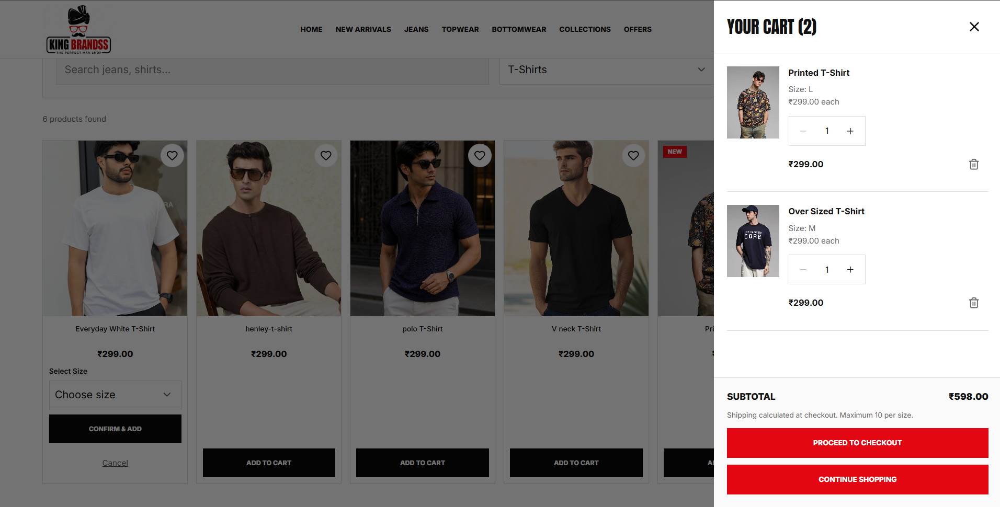

# KING BRANDSS

A responsive e-commerce front-end built for the KING BRANDSS practical assignment, using the supplied HTML design as the primary reference.

## Links

- Live website: https://king-brandss.vercel.app/
- Source code: https://github.com/ketanjais12/king-brandss

## Screenshots

### Homepage — Desktop



### Homepage — Mobile



### Collections



### Shopping Cart



## Tech Stack

- React + Vite
- React Router
- CSS
- Lucide React
- React Context
- Browser localStorage

## Features

- Responsive homepage, navigation and mobile menu
- Product collections, category filters, search and sorting
- Product details with size selection
- Persistent wishlist
- Cart drawer with quantity controls, removal and subtotal
- Separate cart entries for different product sizes
- Validated demo checkout and order confirmation
- Browser-based demo order history
- Promotional collection links
- Newsletter email validation and local preference saving
- Customer-care and information pages
- Fallback pages for unknown routes and products

## Run Locally

Install Node.js and npm, then run:

```bash
git clone https://github.com/ketanjais12/king-brandss.git
cd king-brandss
npm ci
npm run dev
```

Open the URL printed in the terminal.

## Commands

```bash
npm run dev      # Development server
npm run lint     # ESLint checks
npm run build    # Production build
npm run preview  # Preview the production build
```

## Project Structure

```text
public/         Static assets
src/components/ Reusable UI components
src/context/    Shared cart and wishlist state
src/data/       Product catalogue
src/hooks/      Shared hooks
src/pages/      Route pages
src/utils/      Price formatting and order storage
```

## Implementation Notes

- Cart entries are identified by product ID and size.
- Quantity is limited to 10 per product-size combination.
- Cart totals use prices from the product catalogue.
- Demo orders store product and price snapshots.
- Search and filter selections are represented in URL parameters.
- Vercel rewrites support direct access to React Router routes.

## Demo Scope

This is a front-end demonstration, not a live commerce service.

- No backend, real authentication or payment gateway is connected.
- Demo orders do not initiate shipping or fulfilment.
- The account page shows order history saved in the current browser.
- Cart, wishlist, newsletter preference and demo orders use localStorage.
- Checkout contact details and addresses are not persisted or sent to a server.
- Newsletter submissions do not subscribe users to an email service.
- Shipping is set to zero for demonstration.
- Additional catalogue entries use sample prices and sizes.
- Promotional banners link to collections; no coupon system is implemented.

## Design and Assets

The supplied KING BRANDSS design and logo were used as references.
The implementation includes an expanded catalogue, mixed New Arrivals
and category-specific browsing controls.

Some product photography is representative and may differ from the
supplied reference. Brand assets belong to their respective owners.

## Verification

Before submission, verify:

- Search, filtering and sorting
- Wishlist persistence after refresh
- Cart size variants, quantities, removal and totals
- Checkout validation and saved demo orders
- Mobile and tablet layouts
- Direct route access and refresh on the deployed site
- Missing images and browser console errors

## Author

Ketan Jaiswal